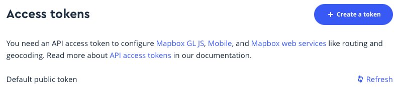

## tfm-jeff-edem

### Pasos crear clave de la API de mapbox:

Crear una cuenta en la siguiente [pagina web](https://account.mapbox.com) Una vez estamos en nuestro perfil, nos dirigimos a la parte inferior de la pagina 

se hace click en "Create Token" una vez tenemos el valor de el token publico y creamos el fichero mapboxkeyd.csv gastando como base el fichero [mapboxkeys_Template.csv](mapboxkeys_Template.csv)

### Pasos crear clave de la API de Google:
Para ello nos dirigimos a la siguiente [pagina](https://developers.google.com/maps/documentation/javascript/get-api-key) y seguimos los pasos descritos en el apartado "Creating API keys".